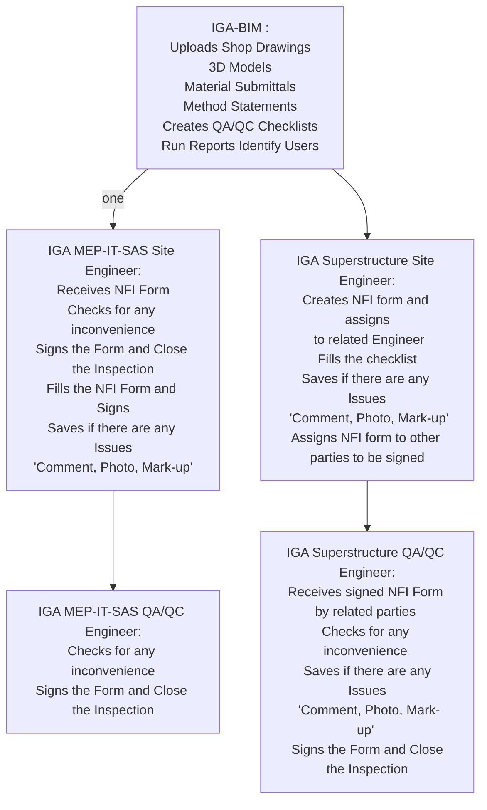

```mermaid
flowchart TD

	A[IGA-BIM :<br />Uploads Shop Drawings<br />3D Models<br />Material Submittals<br />Method Statements<br />Creates QA/QC Checklists<br />Run Reports Identify Users<br /> ]
	-->|one| B[IGA MEP-IT-SAS Site Engineer:<br />Receives NFI Form<br />Checks for any inconvenience<br />Signs the Form and Close the Inspection<br />Fills the NFI Form and Signs<br />Saves if there are any Issues<br />'Comment, Photo, Mark-up']
	C[IGA MEP-IT-SAS QA/QC Engineer:<br />Checks for any inconvenience<br />Signs the Form and Close the Inspection]
	B-->C
	D[IGA Superstructure Site Engineer:<br />Creates NFI form and assigns<br /> to related Engineer<br />Fills the checklist<br />Saves if there are any lssues<br /> 'Comment, Photo, Mark-up'<br />Assigns NFI form to other parties to be signed]
	E[IGA Superstructure QA/QC Engineer:<br />Receives signed NFI Form by related parties <br />Checks for any inconvenience <br /> Saves if there are any Issues<br /> 'Comment, Photo, Mark-up' <br /> Signs the Form and Close the Inspection]
	A-->D-->E
```

